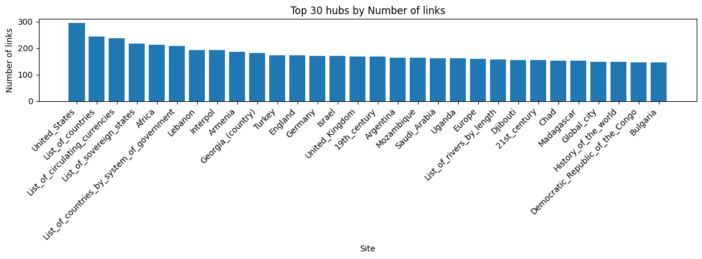
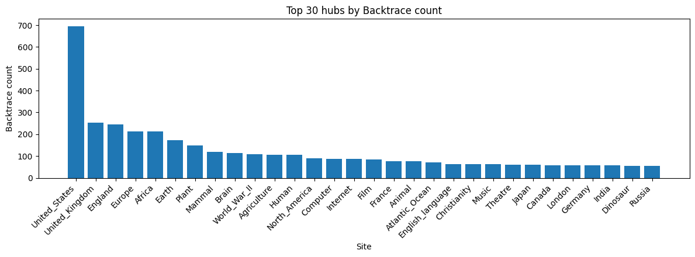
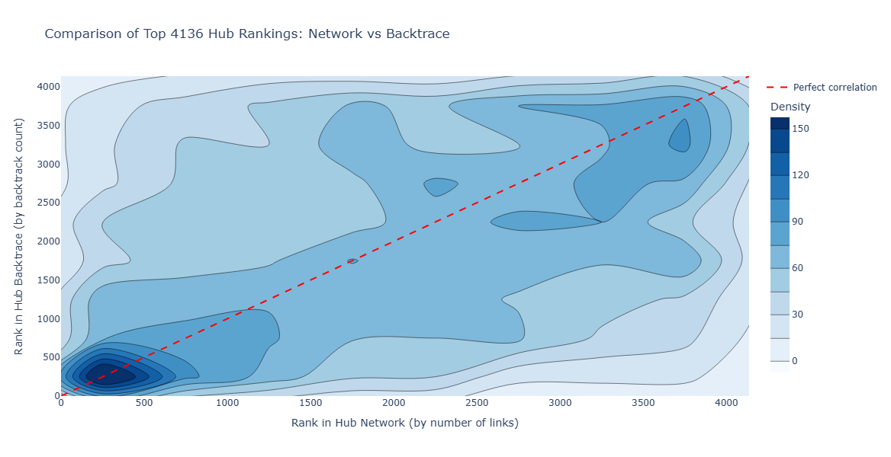
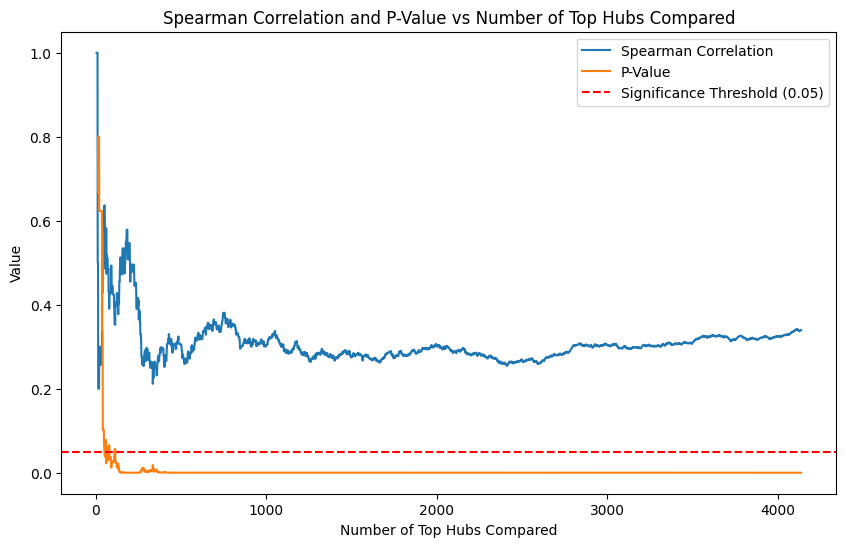
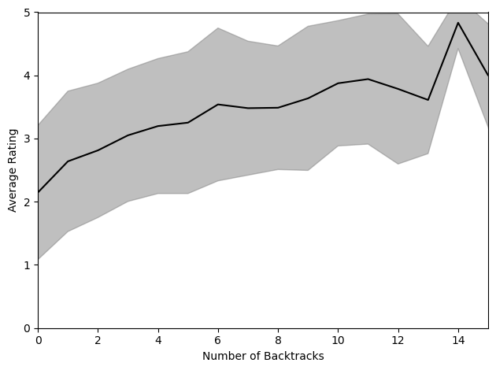
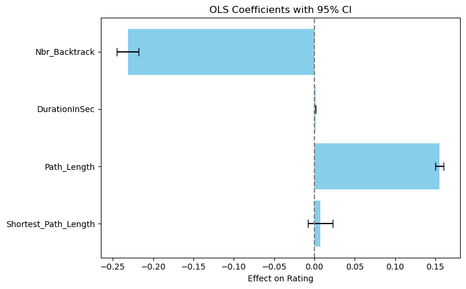
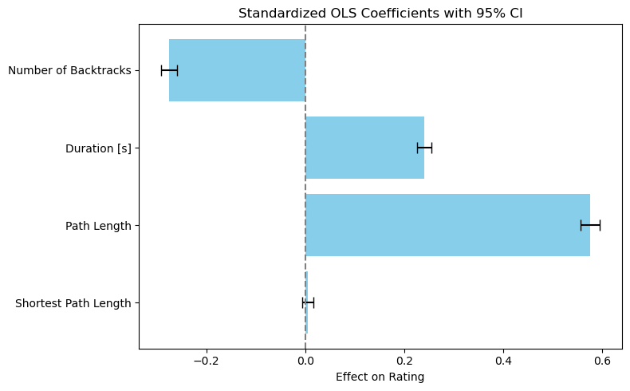
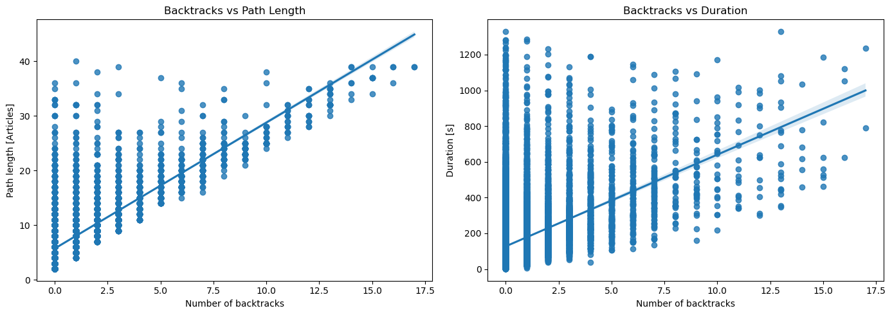

# IndiADA Jones and the raiders of the human knowledge

## Chapter 1 : Finding your way in the big bad network

Imagine this: you are an untrademarked, totally unspecified explorer and you are tasked with exploring an ancient ruin containing all of humanity's knowledge. You are given a map and you have to find your way from one point in the ruin to another. Pretty easy, right?

Now imagine you are given this map:

<iframe src="browsers/network_map_random_nodes.html" width="100%" height="600" style="border:none;"></iframe>

This is the task given to you in the game Wikispeedia: you have to find your way from one article to another using only hyperlinks. On the map above, each dot is an article and each line represents a hyperlink from one to the other. When you start the game, you are dropped into your start article and you have to navigate in Wikipedia to your target article. The map is actually just in your mind. Understanding how users choose to navigate this network can be very informative about what subjects users believe relate to each other. 

Now this task sounds pretty scary, we get it. 

You could set out and get caught in dangerous traps. You may want to go back, retrace your steps to try and find your way in this maze. And actually it turns out a lot of explorers (or okay... just Wikispeedia nerds) do just that.

<iframe 
  src="figures/backtracking_pie.html"
  width="100%"
  height="500"
  frameborder="0">
</iframe>

20% of paths in our Wikispeedia dataset contain backtracking. 
You can take a look at what paths past users have done here:

<iframe src="browsers/network_map_clustered_nodes_with_dropdown.html" width="100%" height="600" style="border:none;"></iframe>

This map is maybe closer to how you would actually imagine it to be to orient yourself. The articles are sorted by proximity of vocabulary used in each one, so Paris is sorted close to France, anything to do with Poland forms a cluster... 

When we saw the amount of bcaktracking users did, we immediately wondered where these people backtracked to, what pushed them to go back and, obviously, whether it would make them more likely to lose the game. 

Let's take a look!

## Chapter 2 : Where did you come from, where did you go?

People use backtracking sometimes. However, before asking why, let's first look at how. How do people use backtracking, and more importantly, where do they go? Remember that the map is not visible, so it is virtually impossible for you to know whether you are on the right track or not.

To begin with, we will determine which sites are network hubs and which are backtracking hubs. In this context, network hubs are sites that have a large number of hyperlinks, and therefore connections to other sites, while backtracking hubs are sites that have been found to be a return point when using backtrack.

Interesting... We can already see that certain sites are quite high up in both distributions. But is this a happy coincidence, or could there actually be a hidden connection between the two ?

In order to determine whether there is a direct correlation between the number of links and the backtrace count, we need to look at all the points. 

The correlation between the number of links and the number of backtraces is quite low, suggesting that the hubs in the network are not necessarily the same as those frequently used for backtracking. However, there is a point of high density on the right side of the graph, indicating that there is a certain set of sites that follows the correlation. 

Let's go a little further to better understand what is happening in the high-density zone. Let's do a Spearman Correlation and P-Value test for the data sets that are the first n elements of each dataFrame. The idea is to identify which sets produce the highest correlation. Why? We'll get to that very soon...

What can we see? Well, first of all, the score decreases as more data is taken into account, which is not very encouraging for the next parts. But we also notice that with few elements, the score is not so bad. We have a respectable correlation score with the first 250 elements or so, which was already indicated by the previous graph.

You're probably thinking that this is simply the effect of the law of small numbers, which produces results that are not necessarily relevant. However, you would be wrong to think that this is all there is to say...

There is something that has not yet been presented, namely, the distribution of hubs.

How does this distribution change the situation? First of all, the distributions do not follow the same trend, but that is not very important. The reason for the previous rather weak results is highlighted here.

When testing the correlation, we relied on the location of an element in the dataframe. However, It should be noted that the lower a site's backtrack score, the more it shares the same score with other sites, unlike the number of hyperlinks. 

Why would that be a problem, you ask ? 

Well, since many sites share the same backtrack score, their ranking is no longer very meaningful if we focus on low scores. For example, take a site with a backtrack score of 1. Could you say precisely which index it should occupy in the dataframe? A normal person cannot know that. It could be element 1700 or 2400, depending of the ordrer that the code is processing the data. This will create a very significant variance and it's this aspect that greatly reduces correlation as values are added.

## Chapter 3 : Why are users backtracking?

### Hypothesis 1 : Experience level

### Hypothesis 2 : Subjects in the path

Another reason we think users may want to go back is if they are not familiar with the subject of the final article or with the subject of the starting article. Lack of familiarity would prevent them from being to plan an efficient path and could therefore cause some backtracking. 

To look into this hypothesis, we decided to create heatmaps of start and end categories of articles in paths of the dataset.

<iframe 
  src="figures/category_heatmaps.html"
  width="100%"
  height="500"
  frameborder="0">
</iframe>

Both finished and unfinished paths seemed to carry more backtracking in the same category combinations. What this analysis reveals is that some category combinations of start and end article seem to cause more backtracking. For example, when users are tasked with navigating from Science to Science, they tend to backtrack the most. Now, there are several reasons why this could happen. 

As an explorer, if someone tells you to go to Lithuania and you don't know where Lithuania is, well, you could get lost somewhere between Estonia and Latvia and need a few attempts to find your way. 

Another possibility is that maybe people are just interested in the subject. Maybe these explorers just wanted to spend more time reading up on the subject.   

Here are the top 5 articles that cause the most backtracking when they are the target of the path. 

| Rank | Article | Category | 
| :--- | :--- | :--- |
| **1**| Morecambe_and_Wise | Everyday_life|
| **2**| Felix_the_Cat | Everyday_life |
| **3**| Nurse_sharks | Science |
| **4**| Borage | Science |
| **5**| Lake_Victoria | Geography |

In the list, the articles that appear are part of the categories that were highlighted on the heatmap as being problematic, such as Everyday_life and Science. When you're not familiar with a destination, it's hard to find your way to it, right ? Players backtracked more when they were looking for these 5 articles in particular, perhaps because unfamiliarity with the subjects. 

Would you have found your way to Borage ? Find out [here](https://dlab.epfl.ch/wikispeedia/play/?article=Latin).

## Chapter 4 : Will backtracking doom you to fail ?

### Paths with and without backtracking in successful and unsuccessful paths

### Number of backtracks in finished and unfinished paths histogram

<iframe 
  src="figures/distrib_fin_vs_unfin.html"
  width="100%"
  height="500"
  frameborder="0">
</iframe>

This graph shows us the distribution of paths per certain amount of backtracking. It serves to highlight the wide range of amounts of backtracking in the database.

### Spearman's Rank correlation

In order to determine whether there was any significant non linear correlation between backtraking and success, we computed the Spearman's rank correlation on paths with and without backtracking and failure and success.

// Results of Spearman

Games where the user has backtracked have a slight tendency to be unsuccessful.

## Chapter 5 : The effect of backtracking on user difficulty perception

When we realized that our adventurers were not more likely to fail when they backtracked, we wondered if backtracking could impact their perception of the difficulty of the game.

Ratings are optionally given by the user after finishing the game and range from 1 ("easy") to 5 ("brutal"). We wanted to describe how backtracking affect the ratings (i.e. the difficulty perception). After some proper data processing, we first performed a naive analysis of univariable relationship between the number of backtracking and the average rating of each game. The first conclusion is that average rating increases as the number of backtracks increases and it was exactly what we hypothetized before doing this analysis.

Nonetheless, to isolate the specific effect of backtracking, we performed Ordinary Least Squares (OLS) regression. We predicted rating using the number of backtrack, game duration, the number of articles visited , and the minimal number of articles seperating the two articles .

#### Coefficients

| Variable | coef | std err | t | P>\|t\| | [0.025 | 0.975] |
| :--- | :--- | :--- | :--- | :--- | :--- | :--- |
| **Intercept** | 1.0532 | 0.025 | 41.833 | 0.000 | 1.004 | 1.103 |
| **Number of Backtrack** | -0.2313 | 0.007 | -33.478 | 0.000 | -0.245 | -0.218 |
| **Duration [s]** | 0.0017 | 5.31e-05 | 32.605 | 0.000 | 0.002 | 0.002 |
| **Path Length** | 0.1553 | 0.003 | 58.347 | 0.000 | 0.150 | 0.161 |
| **Shortest Path Length** | 0.0074 | 0.008 | 0.951 | 0.341 | -0.008 | 0.023 |

Counterintuitively, backtracking has a clear and substantial impact on how players perceive the difficulty of the game. In the regression, the number of backtracks shows a strong negative coefficient (–0.23), meaning that each additional backtrack is associated with a lower difficulty rating once path length, duration, and shortest path length are controlled for. This indicates that players who backtrack frequently do not interpret these movements as signs of a demanding or punishing task. Instead, backtracking seems to reflect exploration that does not translate into a feeling of high difficulty. Overall, the number of backtracks is a robust predictor of lower perceived difficulty.

#### Coefficients (standardized)

| Variable | coef | std err | t | P>\|t\| | [0.025 | 0.975] |
| :--- | :--- | :--- | :--- | :--- | :--- | :--- |
| **Intercept** | 2.2618 | 0.006 | 410.609 | 0.000 | 2.251 | 2.273 |
| **Number of Backtrack** | -0.2754 | 0.008 | -33.478 | 0.000 | -0.292 | -0.259 |
| **Duration [s]** | 0.2412 | 0.007 | 32.605 | 0.000 | 0.227 | 0.256 |
| **Path Length** | 0.5768 | 0.010 | 58.347 | 0.000 | 0.557 | 0.596 |
| **Shortest Path Length** | 0.0053 | 0.006 | 0.951 | 0.341 | -0.006 | 0.016 |

Using standardized coefficients makes it possible to compare the relative strength of each predictor on the same scale. For ratings, the standardized effect of backtracking is strongly negative (β = –0.28). This means that, when all variables are expressed in standard deviation units, an increase of one standard deviation in the number of backtracks leads to a decrease of about 0.28 standard deviations in the perceived difficulty rating. Among all predictors, backtracking is the only negative driver of difficulty perception and one of the strongest predictors overall, second only to path length.

Our naive analysis could not show this effect since bactracking strongly affect the game duration and path length. More backtracking is associated with longer path length and longer game duration as shown in the following plots. Each additional backtrack increases the total path length by about 2.3 articles and adds roughly 51 seconds to the completion time. Backtracking therefore makes trajectories longer and substantially slows players down. However, the negative effect of backtracking on rating is likely independent of path length and game duration, maybe due to exploration behavior or other cognitive factors.

## Chapter 6 : Conclusion

And now, you've reached the end of the adventure. 

By exploring the Wikispeedia dataset, we were able to conclude that:

- Users usually go back to well connected hubs when they backtrack
- An experienced Wikispeedia user tends to backtrack more than inexperienced users 
- Some combinations of categories of articles tend to cause more backtracking than others
- Backatracking has little effect on overall success in the game 
- Counterintuitively, more backtracking is linked to lower difficulty ratings

These all lead us to the conclusion that backtracking will not affect your game negatively. You may actually find your games easier if you allow yourself to backtrack and it will not make you more likely to fail.

So, make mistakes, explore, go back and you may find that your time adventuring will feel even more rewarding.
All this to say, it's not about the destination, it's about the journey.