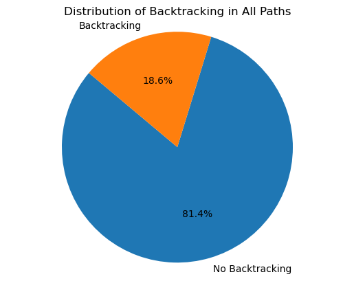
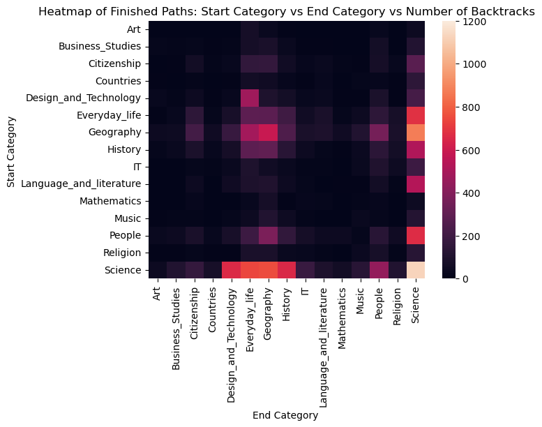
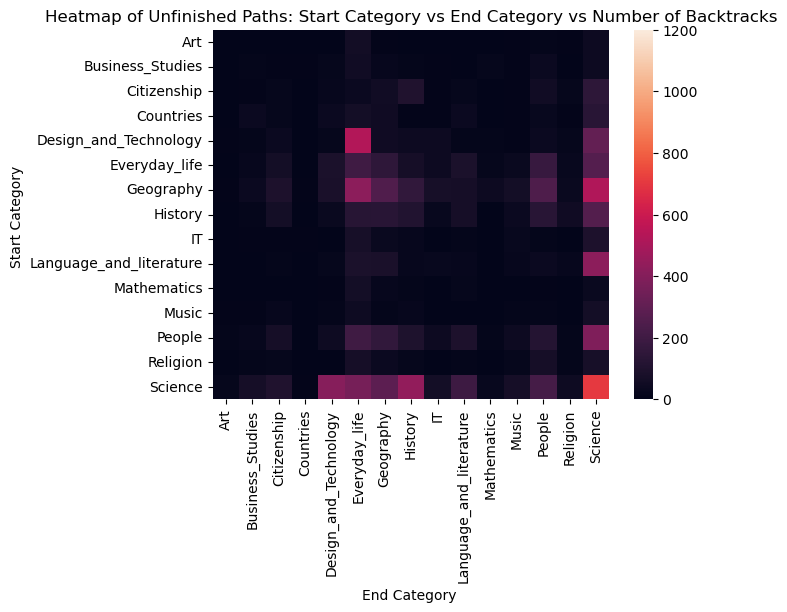
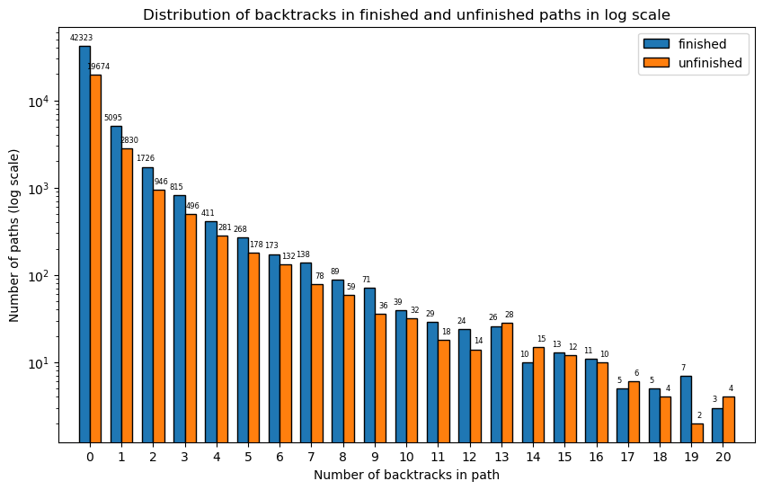

# Backtrack to the future

## Chapter 1 : Finding your way in the big bad network

Imagine this: you are an untrademarked, totally unspecified explorer and you are tasked with exploring an ancient ruin containing all the world's knowledge. You are given a map and you have to find your way from one point in the ruin to another. Pretty easy, right?

Now imagine you are given this map:

<iframe src="network_map_random_nodes.html" width="100%" height="600" style="border:none;"></iframe>

This is the task given to you in the game Wikispeedia: you have to find your way from one article to another using only hyperlinks. On the map above, each dot is an article.

Okay, okay, we're just kidding. Maybe in your brain you could see it more like this:

<iframe src="network_map_clustered_nodes.html" width="100%" height="600" style="border:none;"></iframe>

This is the map of articles sorted into their main category. For exemple, cities end up in the Geography category, atoms in science, etc...

Now this task sounds pretty scary, we get it. 

You could set out and get caught in dangerous traps. You may want to go back, retrace your steps to try and find your way in this maze. And actually it turns out a lot of explorers (or okay... just Wikiuspeedia nerds) do just that.

20% of paths in our Wikispeedia dataset contain backtracking. 
You can take a look at what paths past users have done here:

// interactive map to highlight paths

When we saw this, we immediately wondered where these people backtracked to, why they did it, what pushed them to go back and, obviously, whether it would make them more likely to lose the game. 

Let's take a look!

## Chapter 2 : Where did you come from, where did you go?

## Chapter 3 : Why are users backtracking?

### Hypothesis 1 : Experience level

### Hypothesis 2 : Subjects in the path

Another reason we think users may want to go back is if they are not familiar with the subject of the final article or with the subject of the starting article. Lack of familiarity would prevent them from being to plan an efficient path and could therefore cause some backtracking.

To look into this hypothesis, we decided to create heatmaps of start and end categories of articles in paths of the dataset.

Both finished and unfinished paths seemed to carry more backtracking in the same category combinations.

For example, when users are tasked with navigating from Science to Science, they tend to backtrack the most.

Here are the top 5 articles that cause the most backtracking when they are the target of the path. 

| Rank | Article | Category | 
| :--- | :--- | :--- |
| **1**| Morecambe_and_Wise | Everyday_life|
| **2**| Felix_the_Cat | Everyday_life |
| **3**| Nurse_sharks | Science |
| **4**| Borage | Science |
| **5**| Lake_Victoria | Geography |

In the list, the articles that appear are part of the categories that were highlighted on the heatmap as being problematic, such as Everyday_life and Science. When you're not familiar with a destination, it's hard to find your way to it, right ? Players backtracked more when they were looking for these 5 articles in particular, perhaps because unfamiliarity with the subjects. 

Would you have found your way to Borage ? Find out [here](https://dlab.epfl.ch/wikispeedia/play/?article=Latin).

## Chapter 4 : Will backtracking doom you to fail ?

### Paths with and without backtracking in successful and unsuccessful paths

### Number of backtracks in finished and unfinished paths histogram

This graph shows us the distribution of paths per certain amount of backtracking. It serves to highlight the wide range of amounts of backtracking in the database.

### Spearman's Rank correlation

In order to determine whether there was any significant non linear correlation between backtraking and success, we computed the Spearman's rank correlation on paths with and without backtracking and failure and success.

// Results of Spearman

Games where the user has backtracked have a slight tendency to be unsuccessful.

## Chapter 5 : The effect of backtracking on user difficulty perception

Ratings are optionally given by the user after finishing the game and range from 1 ("easy") to 5 ("brutal"). We wanted to describe how backtracking affect the ratings (i.e. the difficulty perception). After some proper data processing, we first performed a naive analysis of univariable relationship between the number of backtracking and the average rating of each game. The first conclusion is that average rating increases as the number of backtracks increases and it was exactly what we hypothetized before doing this analysis.

Nonetheless, to isolate the specific effect of backtracking, we performed Ordinary Least Squares (OLS) regression. We predicted rating using the number of backtrack, game duration, the number of articles visited , and the minimal number of articles seperating the two articles .

#### OLS Regression Results

| Metric | Value | Metric | Value |
| :--- | :--- | :--- | :--- |
| **Dep. Variable** | Rating | **R-squared** | 0.294 |
| **Model** | OLS | **Adj. R-squared** | 0.294 |
| **Method** | Least Squares | **F-statistic** | 2955 |
**Log-Likelihood** | -38066 | **Prob (F-statistic)** | 0.00 |

#### Coefficients

| Variable | coef | std err | t | P>\|t\| | [0.025 | 0.975] |
| :--- | :--- | :--- | :--- | :--- | :--- | :--- |
| **Intercept** | 1.0532 | 0.025 | 41.833 | 0.000 | 1.004 | 1.103 |
| **Number of Backtrack** | -0.2313 | 0.007 | -33.478 | 0.000 | -0.245 | -0.218 |
| **Duration [s]** | 0.0017 | 5.31e-05 | 32.605 | 0.000 | 0.002 | 0.002 |
| **Path Length** | 0.1553 | 0.003 | 58.347 | 0.000 | 0.150 | 0.161 |
| **Shortest Path Length** | 0.0074 | 0.008 | 0.951 | 0.341 | -0.008 | 0.023 |

Counterintuitively, backtracking has a clear and substantial impact on how players perceive the difficulty of the game. In the regression, the number of backtracks shows a strong negative coefficient (–0.23), meaning that each additional backtrack is associated with a lower difficulty rating once path length, duration, and shortest path length are controlled for. This indicates that players who backtrack frequently do not interpret these movements as signs of a demanding or punishing task. Instead, backtracking seems to reflect exploration that does not translate into a feeling of high difficulty. Overall, the number of backtracks is a robust predictor of lower perceived difficulty.

#### OLS Regression Results (Standardized)

| Metric | Value | Metric | Value |
| :--- | :--- | :--- | :--- |
| **Dep. Variable** | Rating | **R-squared** | 0.294 |
| **Model** | OLS | **Adj. R-squared** | 0.294 |
| **Method** | Least Squares | **F-statistic** | 2955 |
 **Log-Likelihood** | -38066 | **Prob (F-statistic)** | 0.00 |

#### Coefficients

| Variable | coef | std err | t | P>\|t\| | [0.025 | 0.975] |
| :--- | :--- | :--- | :--- | :--- | :--- | :--- |
| **Intercept** | 2.2618 | 0.006 | 410.609 | 0.000 | 2.251 | 2.273 |
| **Number of Backtrack** | -0.2754 | 0.008 | -33.478 | 0.000 | -0.292 | -0.259 |
| **Duration [s]** | 0.2412 | 0.007 | 32.605 | 0.000 | 0.227 | 0.256 |
| **Path Length** | 0.5768 | 0.010 | 58.347 | 0.000 | 0.557 | 0.596 |
| **Shortest Path Length** | 0.0053 | 0.006 | 0.951 | 0.341 | -0.006 | 0.016 |

Using standardized coefficients makes it possible to compare the relative strength of each predictor on the same scale. For ratings, the standardized effect of backtracking is strongly negative (β = –0.28). This means that, when all variables are expressed in standard deviation units, an increase of one standard deviation in the number of backtracks leads to a decrease of about 0.28 standard deviations in the perceived difficulty rating. Among all predictors, backtracking is the only negative driver of difficulty perception and one of the strongest predictors overall, second only to path length.

Our naive analysis could not show this effect since bactracking strongly affect the game duration and path length. More backtracking is associated with longer path length and longer game duration as shown in the following plots. Each additional backtrack increases the total path length by about 2.3 articles and adds roughly 51 seconds to the completion time. Backtracking therefore makes trajectories longer and substantially slows players down. However, the negative effect of backtracking on rating is likely independent of path length and game duration, maybe due to exploration behavior or other cognitive factors.

## Chapter 6 : Conclusion

With this analysis of the Wikispeedia dataset, we were able to conclude that:

- users usually go ... when they backtrack
- an experienced Wikispeedia user ...
- the average Wikispeedia user backatracks more when it comes to subjects like science 
- backatracking has little effect on overall success in the game 
- Counterintuitively, more backtracking is linked to lower difficulty ratings.

These all lead us to conclude that backtracking will not affect your game negatively. You may actually find your games easier if you allow yourself to backtrack and it will not make you more likely to fail.

All this to say, it's not about the destination, it's about the journey.